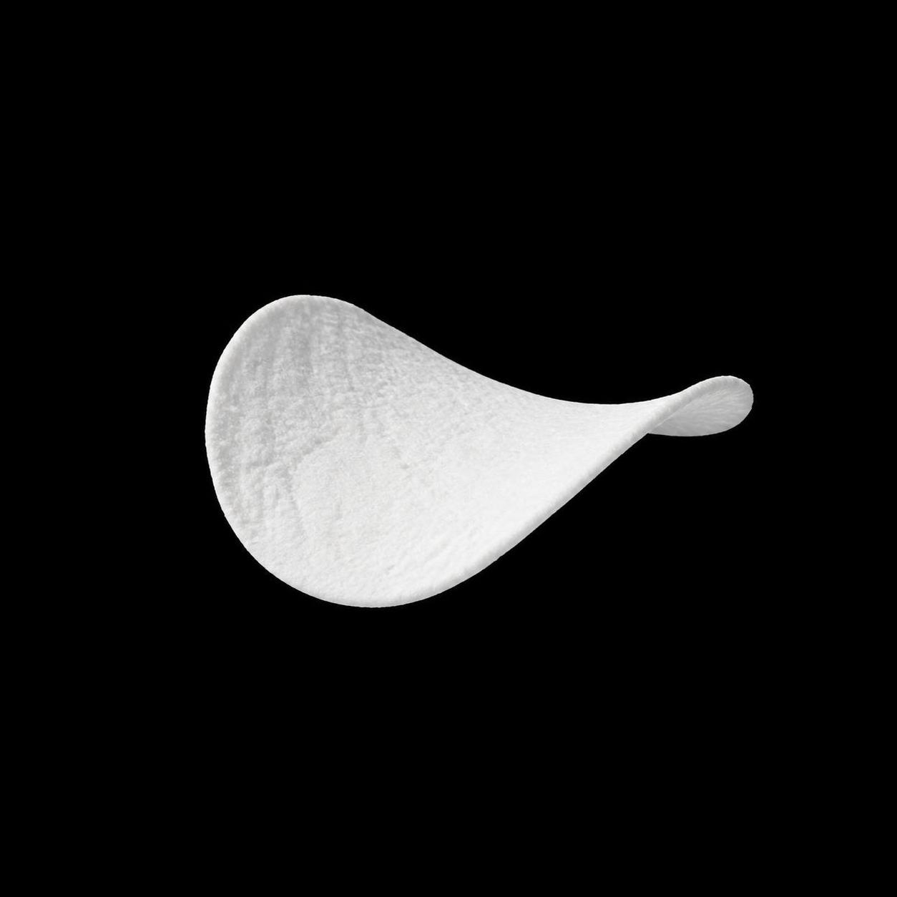

# OmniCrawl

<p align="center">
  
</p>

OmniCrawl 是一款本地运行的个人 AI 编程助手（终端工作台），提供全屏 TUI 与本地 HTTP/SSE API。它以 Agent 循环方式执行任务：理解目标 → 读取项目文件 → 搜索文本 → 编写或修改文件 → 执行命令，并默认在工具执行前请求人工确认（也可切换自动审批模式）。

## 功能特性

- **多模型协议**：通过统一运行时调用 OpenAI Chat Completions / Responses、Anthropic Messages、Google Gemini Generate Content（各用原生 SDK），支持思考模式、流式输出与中断自动重试。
- **终端 TUI**：Rust 全屏工作台（`omnicrawl-tui`），键盘交互，内置模型热切换、渠道管理、设置面板、审批控制、事务式 `/undo` 回退、取消回合上下文保留。
  （仓库内保留的 Python Textual UI 已弃用，仅作开发对照：`OMNICRAWL_LEGACY_PYTHON_UI=1`。）
- **HTTP/SSE API**：本地服务可对接 Web 或桌面前端，`Swagger UI` 文档开箱即用。
- **工具与安全**：内置文件读写、文本搜索、本地图片读取、视觉模型代理、Bash/PowerShell、Windows 桌面控制、记忆与 SubAgent 等工具，可在 `config.toml` 的 `tools` 段逐工具开关；SubAgent 支持独立 Git worktree 隔离执行。子代理全局设置与每个子代理的模型选择放在独立的 `subagents.toml`（模板见 `subagents.example.toml`），已从 `config.toml` 完全迁移，不再回退读取 `config.toml` 的 `[subagents]` 段。
- **统一工具分发**：模型只看到固定的 `search_tools` 与 `invoke_tool`；真实工具 Schema、审批策略、MCP 能力和执行器由 Host 侧目录维护，详见 `omnicrawl/docs/TOOL_CALLING.md`。
- **可扩展**：支持 NPM Hook 插件、Skill 技能、MCP Server 接入，以及自定义 `models.toml` 模型目录。

## 环境要求

- Python `>=3.9`
- 安装完整功能建议本机具备 Node.js 20+（仅插件功能需要，缺失不影响无插件模式启动）
- `grep`/`find` 的文本搜索由随包分发的 Go 原生扩展执行（`omnicrawl/_ocsearch.pyd`/`.so`，abi3 稳定 ABI，覆盖 Python 3.9+），源码在 `native/`；wheel 不再内置 ripgrep 二进制。原生扩展不可用时（从源码安装且未编译、或平台不在构建矩阵内）自动回退到 PATH 中的 `rg`，两者都没有时会明确报错

## 安装

### 从 PyPI 安装（推荐）

```powershell
pip install omnicrawl-agent
```

### 从源码运行

```powershell
git clone https://github.com/cccchiban/omnicrawl.git
cd omnicrawl

pip install -r requirements.txt
# 可选：以可编辑方式安装 console script（同时提供 ocl 和 omnicrawl 两个命令）
pip install -e . --no-build-isolation
```

### 构建原生搜索扩展（发布 wheel 时需要）

搜索核心是 Go 实现（`native/`），随 wheel 分发；构建需要 Go 1.21+ 与 cgo 可用的
C 编译器（`gcc`/`clang`，Windows 上是 MinGW-w64，**MSVC 的 `cl.exe` 不被 cgo 支持**）：

```powershell
# 可选：单独构建扩展
python native/build.py --out omnicrawl/_ocsearch.pyd

# 构建 wheel（产物：omnicrawl_agent-<版本>-cp39-abi3-<平台>.whl）
python setup.py bdist_wheel
```

Windows 缺少编译器时可用 `winget install BrechtSanders.WinLibs.POSIX.UCRT`。发布
wheel 时建议设置 `OMNICRAWL_REQUIRE_NATIVE_SEARCH=1`，让缺少工具链的构建直接失败；
未设置时构建降级为“不带原生扩展”，运行时回退到 PATH 上的 `rg`。abi3 只省去按
Python 版本分份，仍需在 Linux/macOS 各构建一次。详见 `native/README.md`。

## 启动

### 终端 TUI

```powershell
ocl
```

`omnicrawl` 为兼容旧命令的等价入口；源码目录下也可直接运行 `python main.py`。

首次启动会引导配置模型渠道（预置 OpenAI、Anthropic、Gemini，支持自定义 Base URL 与 API Key），配置保存在本机 `~/.OmniCrawl`。至少保存一个已启用且具备 Key 的默认渠道后，重新运行 `ocl` 即可进入工作台。

如果本机配置了 Telegram（Bot Token + 授权用户 ID）或飞书（App ID + App Secret），
启动 TUI 时会自动拉起对应的独立连接器子进程；未配置的平台不会启动，连接器故障不阻塞
TUI，退出 TUI 时会自动回收连接器。同一平台同一用户只允许一个活动连接器实例：
多个 TUI/API 进程并存时，后启动方会自动跳过，避免 Telegram/飞书重复长连接。
设置 `OMNICRAWL_AUTO_START_CONNECTORS=0` 可关闭该联动。配置方法与安全边界见
`omnicrawl/docs/TELEGRAM.md`、`omnicrawl/docs/FSAPP.md`。

常用操作：

- `Enter` 发送消息，`Shift+Enter` 换行；`Esc` 取消当前任务或聚焦输入框
- `/model` 双列切换模型；`/settings` 打开设置与渠道管理；`/approval:auto|manual|review` 切换审批模式
- `/new` 开启新对话；`/undo` 事务式回退上一轮；`/skills`、`/mcp` 查看技能与 MCP 状态
- `Ctrl+Q` 退出

### 本地 HTTP/SSE API

```powershell
$env:OMNICRAWL_API_TOKEN = "请替换为随机长令牌"
python -m omnicrawl.api
```

默认监听 `127.0.0.1:8765`，Swagger UI 位于 `http://127.0.0.1:8765/docs`，机器可读契约位于 `/openapi.json`。除健康检查与文档外，所有接口需携带 `Authorization: Bearer <token>`。完整接入说明见 `omnicrawl/docs/API.md`。

## 项目结构

```text
omnicrawl/
├── agent/         # Agent 循环、SubAgent、上下文压缩与技能
├── api/           # 本地 HTTP/SSE 服务
├── config/        # 配置加载（core/ 基础仓库、models/ 模型渠道、features/ 功能开关）
├── llm/           # 多协议模型运行时
├── ui/            # Textual 终端 UI（已弃用，保留作开发对照；产品 TUI 在 rust/crates/omnicrawl-tui）
├── workspace/     # 工作区工具与搜索后端封装
├── connectors/    # Telegram/飞书远程连接与自动启动监督器
└── docs/          # 技术文档
```

## 开源协议

本项目基于 [MIT License](LICENSE) 开源发布。

```
MIT License

Copyright (c) 2025 OmniCrawl

Permission is hereby granted, free of charge, to any person obtaining a copy
of this software and associated documentation files (the "Software"), to deal
in the Software without restriction, including without limitation the rights
to use, copy, modify, merge, publish, distribute, sublicense, and/or sell
copies of the Software, and to permit persons to whom the Software is
furnished to do so, subject to the following conditions:

The above copyright notice and this permission notice shall be included in all
copies or substantial portions of the Software.

THE SOFTWARE IS PROVIDED "AS IS", WITHOUT WARRANTY OF ANY KIND, EXPRESS OR
IMPLIED, INCLUDING BUT NOT LIMITED TO THE WARRANTIES OF MERCHANTABILITY,
FITNESS FOR A PARTICULAR PURPOSE AND NONINFRINGEMENT. IN NO EVENT SHALL THE
AUTHORS OR COPYRIGHT HOLDERS BE LIABLE FOR ANY CLAIM, DAMAGES OR OTHER
LIABILITY, WHETHER IN AN ACTION OF CONTRACT, TORT OR OTHERWISE, ARISING FROM,
OUT OF OR IN CONNECTION WITH THE SOFTWARE OR THE USE OR OTHER DEALINGS IN THE
SOFTWARE.
```
